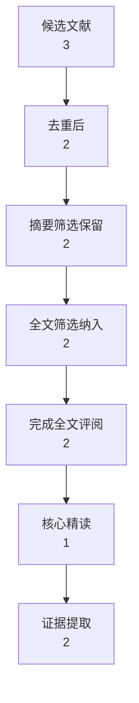
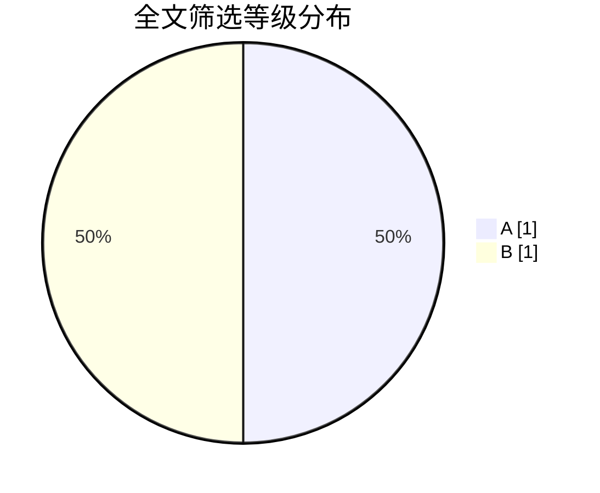
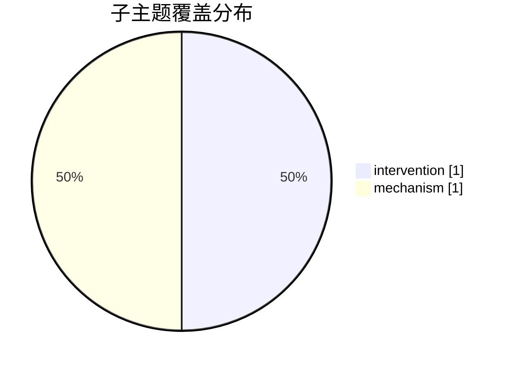

# 统计图表草案

- 项目目录：<USER_HOME>\skill综述测试\skill\cross-disciplinary-review-writer\assets\example-project\minimal-review-project
- schema：review-workflow-v2
- 生成时间：2026-03-14 14:33:24

## 概览
| 指标 | 数值 |
|---|---:|
| 候选文献总量 | 3 |
| 去重后进入初筛 | 2 |
| 摘要筛选保留 | 2 |
| 全文筛选纳入 | 2 |
| 完成全文评阅 | 2 |
| 核心精读 | 1 |
| 证据提取 | 2 |

## 图1 草案：筛选流程图

## 图2 草案：全文筛选等级分布

## 图3 草案：子主题覆盖分布

## 可直接写入图表规划模板的建议
| 图表编号 | 类型 | 目的 | 主要内容 | 证据/数据来源 | 对应章节 | 状态 |
|---|---|---|---|---|---|---|
| 图1 | Mermaid流程图 | 展示筛选链路与保留数量 | 候选文献 -> 去重 -> 摘要筛选 -> 全文筛选 -> 评阅 -> 核心精读 -> 证据提取 | 候选池/筛选/评阅/证据表 | 引言或方法部分 | 草案 |
| 图2 | Mermaid饼图 | 展示全文筛选等级结构 | A/B/C/D 等级分布 | 全文筛选记录表 | 代表性证据比较 | 草案 |
| 图3 | Mermaid饼图 | 展示子主题覆盖均衡性 | 子主题对应的保留/证据数量 | 全文筛选记录表或证据提取表 | 主要研究方向或主题模块 | 草案 |

## 子主题覆盖表
| 子主题 | 数量 |
|---|---:|
| intervention | 1 |
| mechanism | 1 |

