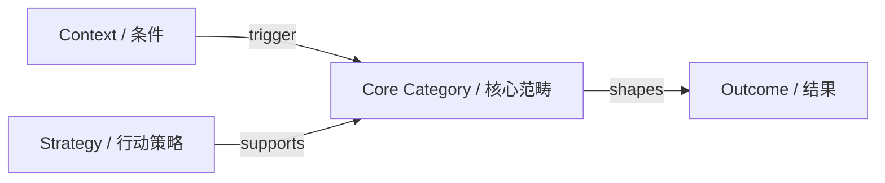

# Grounded Theory Concept Network

## Purpose

Transform qualitative analysis artifacts into a logically disciplined concept network rather than a loose brainstorm diagram.

This skill is especially for grounded theory and adjacent qualitative workflows where category hierarchy and relationship semantics matter.

## When to Use

Use this skill whenever the user:
- mentions 扎根理论, grounded theory, qualitative coding, interview coding, memo writing, category integration
- wants to map open coding -> axial coding -> selective coding
- asks for a theoretical model, concept map, relationship graph, or mechanism flow from qualitative findings
- wants Mermaid code, node-edge tables, NVivo-style concept structures, or Gephi import data
- needs directional links such as “导致”, “促进”, “制约”, “从属于”, “中介”, or “循环强化”

## Core Rule

Do not treat all concepts as flat peers.

Always preserve or infer a hierarchy such as:
- core category
- major categories
- subcategories
- representative concepts / indicators / exemplar evidence

If the user provides messy notes, first normalize the structure before drawing the graph.

## Preferred Outputs

Choose the output format that best matches the user’s next step:

- **Mermaid** for quick preview and discussion
- **node/edge tables** for Gephi / Cytoscape / further network work
- **structured bullet hierarchy** when the source is still too messy for direct visualization

If unspecified, default to Mermaid plus a concise concept hierarchy.

## Relationship Discipline

Every edge should mean something.

Good edge labels include:
- 导致 / leads to
- 促进 / promotes
- 抑制 / constrains
- 从属于 / belongs to
- 构成 / constitutes
- 中介 / mediates
- 调节 / moderates
- 触发 / triggers
- 循环强化 / reinforces

Avoid unlabeled spaghetti links unless the user explicitly wants a rough sketch.

## Workflow

1. Read the user's coding material.
2. Separate levels: raw codes, categories, core category, mechanisms.
3. Remove duplicates and merge semantically overlapping labels.
4. Infer directional or hierarchical relations.
5. Choose a graph structure that reflects theory, not decoration.
6. Output Mermaid or node-edge data with relation labels.

## Mermaid Guidance

When generating Mermaid:
- keep node text concise
- use directional arrows
- label important edges
- group major dimensions if the graph is large
- avoid visually overloaded layouts when a layered flow is clearer

A common pattern is:
- left: causal conditions / context
- center: core category
- right: actions, strategies, outcomes

## Output Template

If using Mermaid, prefer a structure like:

If using node-edge tables, include:
- node_id
- label
- level
- parent
- edge_source
- edge_target
- relation
- note

## Quality Checks

Before finalizing, check:
- Is there a clear core category or central integrating theme?
- Are levels mixed up improperly?
- Are edge labels meaningful?
- Does the graph reflect theory building rather than just topic clustering?
- Could another researcher understand the logic without reading the whole transcript set?

## What to Avoid

Avoid:
- unlabeled webs of arrows
- mixing evidence quotes directly into core graph nodes unless requested
- treating open codes as if they were already axial categories
- overclaiming causality when the user's material only supports association or co-occurrence

## Response Style

Be method-aware and explicit about the logic. If the source material is under-structured, briefly say what assumptions you made while still giving the user a useful first-pass model.
